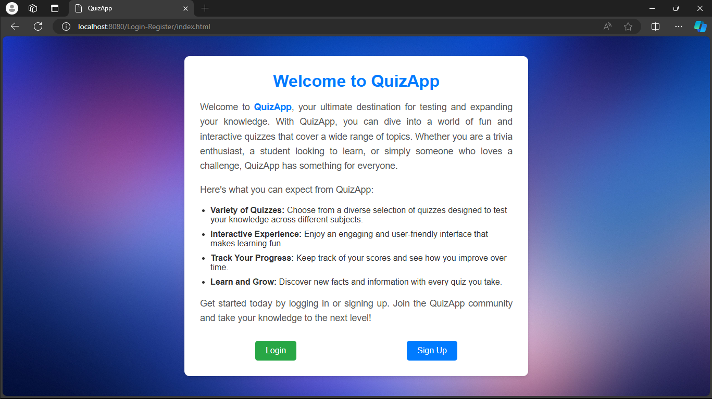
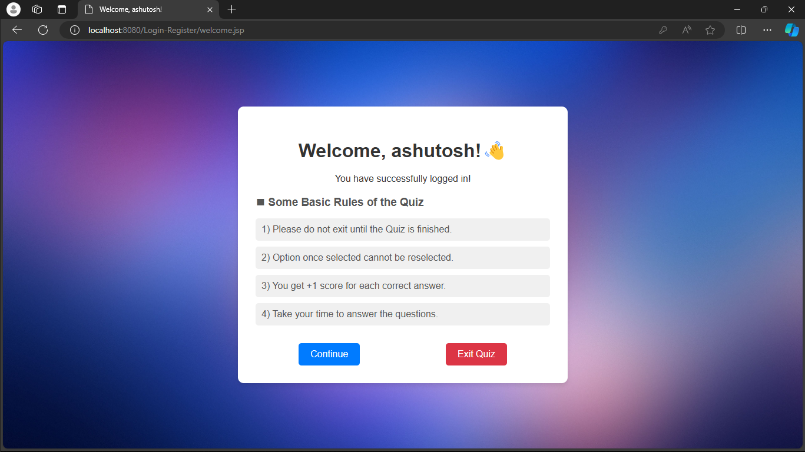
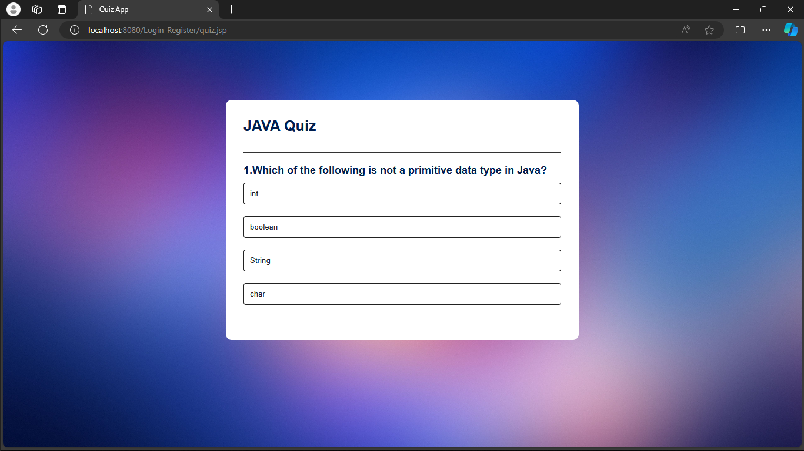
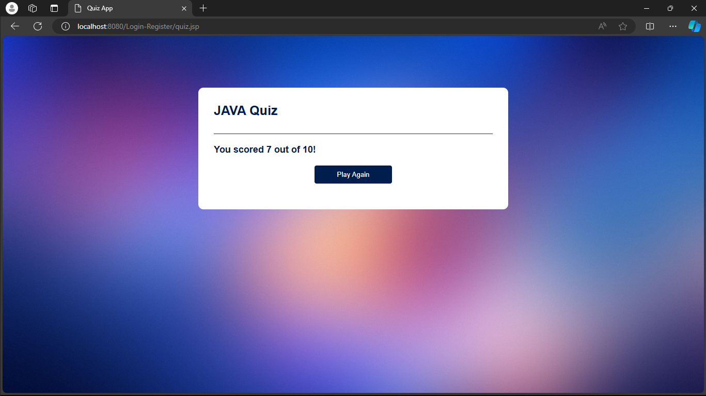

# QuizApp README

## Project Overview

Welcome to **QuizApp**, a Java-based application designed to provide users with an engaging quiz experience. The application ensures that users register and log in before attempting quizzes, maintaining a personalized and secure environment for quiz-taking.

## Features

- User Registration
- User Login
- Quiz Attempt
- Secure and personalized user experience

## Prerequisites

- Java Development Kit (JDK) 8 or higher
- IDE (Eclipse, IntelliJ IDEA, or NetBeans recommended)
- MySQL Database (or any other preferred database)
- **Note**: Please checkout my [Register-Login-Logout Project](https://github.com/ashutoshh-17/Register-Login-Logout) for its working.

## Installation and Setup

### 1. Clone the Repository

```sh
git clone https://github.com/ashutoshh-17/QuizApp
cd QuizApp
```

### 2. Set Up the Database

Create a database named `quizapp` and run the following SQL script to set up the required tables:

```sql
CREATE DATABASE quizapp;
USE quizapp;

CREATE TABLE users (
    id INT AUTO_INCREMENT PRIMARY KEY,
    username VARCHAR(50) NOT NULL UNIQUE,
    password VARCHAR(255) NOT NULL,
);
```

### 3. Configure the Application

Update the database configuration in the `DatabaseConnection.java` file:

```java
public class DatabaseConnection {
    private static final String URL = "jdbc:mysql://localhost:3306/quizapp";
    private static final String USER = "root";
    private static final String PASSWORD = "yourpassword";

    // Rest of the code
}
```

### 4. Build and Run the Application

Compile the project using your preferred IDE or via command line:

```sh
javac -d bin src/com/quizapp/*.java
```

Run the application:

```sh
java -cp bin com.quizapp.Main
```

## Usage

### 1. Register

Before attempting any quiz, users need to register an account. Run the application and select the "Register" option. Provide a unique username, password, and email address.

### 2. Login

After registration, log in using your credentials. Select the "Login" option and enter your username and password.

### 3. Attempt Quiz

Once logged in, you can start attempting quizzes. Choose the "Attempt Quiz" option to begin. Answer the questions by selecting the appropriate options.

## Screenshots

<p align="center">
  
  
  
  
</p>

## File Structure

```
QuizApp/
│
├── src/
│   ├── com/quizapp/
│   │   ├── Main.java
│   │   ├── User.java
│   │   ├── Quiz.java
│   │   ├── DatabaseConnection.java
│   │   ├── UserService.java
│   │   ├── QuizService.java
│   │   ├── UserInterface.java
│   │   └── Utils.java
│
├── bin/
│
├── screenshots/
│   ├── registration.png
│   ├── login.png
│   ├── quiz.png
│
├── README.md
├── .gitignore
└── sql/
    └── setup.sql
```

## Contributing

We welcome contributions! Please fork the repository and submit a pull request with your changes.

## Contact

For any questions or feedback, feel free to contact me

---

Thank you for using QuizApp! Enjoy your quiz experience.
